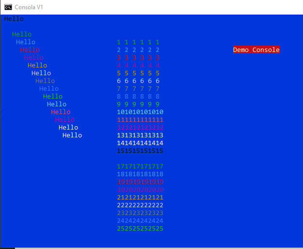

# Hi
This is a small example about implement Basic QBasic GWBasic into C# or C console mode.

In this demo, class BAS.cs implements basic commands like PRINT, LOCATE and COLOR. 

With that command you can implement simple console application like that.

            ScreenTitle("Consola V1");
            Screen(ConsoleColor.DarkBlue, ConsoleColor.White);
            Cls();

            int x = 0;
            int y = 0;
            int c = 0;

            // Hello
            for (x = 0; x <= 15; x++)
            {
                ForeColor(x);
                Locate(1 + x, 1 + x);
                Print("Hello");
            }

            // Hello Numbers
            for (x = 0; x <= 25; x++)
            {
                c++;
                if (c > 15) c = 0;

                for (y = 0; y <= 10; y += 2)
                {
                    ForeColor(c);
                    Locate(x + 10, y+30);
                    Print(x);
                }
            }

            Wait();

# Running code

Download folder and run MAKE.BAT or compile with CSC.exe joining test.cs and bas.cs

Execute test file and enjoy it.

# Objective

* Reduce complexity of code
* Enjoy basic commands
* Learn more about C# compiler

# Console Projects 

This project create a guessing game using variables and input command

https://github.com/sharan8844/NumberGuesser_consoleApp

